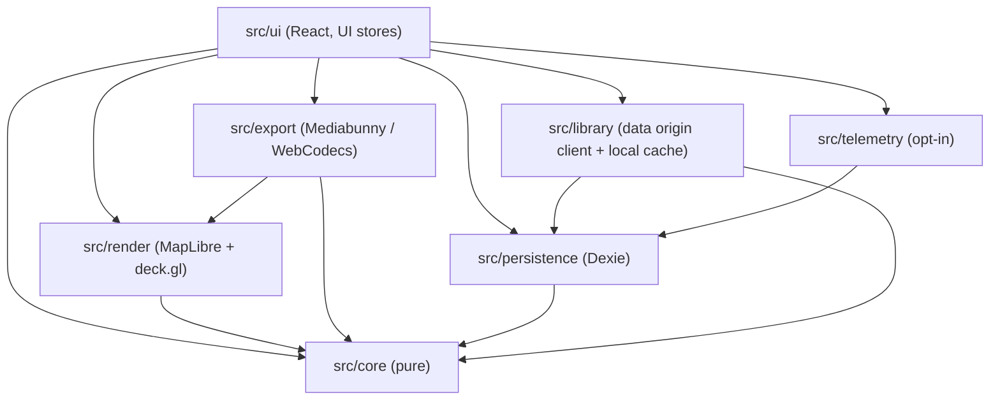
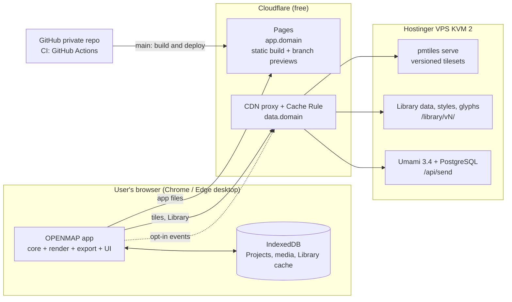
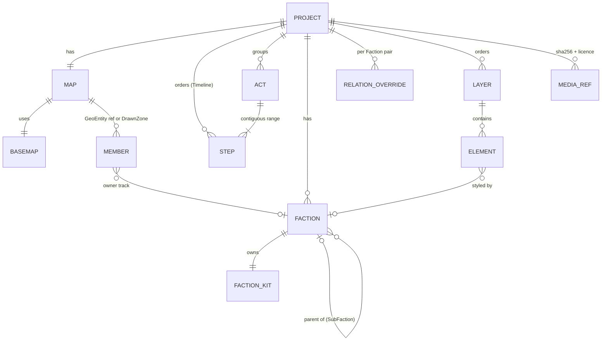

# Architecture Spine — OPENMAP v1

## Design Paradigm

**Functional core / imperative shell, local-first.** The Project is an immutable document changed only by Commands. A pure, deterministic evaluator turns `(project, t, ctx)` into a Scene. Every consumer (edit view, Presentation mode, Step thumbnails, video/image export) draws a Scene and never computes animation itself. There is no application backend in v1. The browser does all editing, rendering, encoding and storage. Servers only deliver static files (the app, tiles, Library data) and receive opt-in telemetry events.

| Layer | Directory | Is | May import |
| --- | --- | --- | --- |
| Core | `src/core/` | Domain model, Commands, timeline, evaluator, derivation, historical dates, seeded PRNG, schema + migrations, Map-locale formatting | only `src/core/` and pure libs (immer, zod, `@turf/*` modules, nanoid). No DOM, React, MapLibre, deck.gl, i18n |
| Adapters | `src/render/`, `src/export/`, `src/persistence/`, `src/library/`, `src/telemetry/` | Imperative shell: WebGL drawing, readiness, encoding, IndexedDB, network | `src/core/`, platform libs, other adapters only through their `index.ts` |
| UI | `src/ui/`, `src/i18n/` | React app, UI stores, tools, dialogs | `src/core/`, adapters through their `index.ts` |



The dependency direction is enforced in CI by dependency-cruiser; forbidden APIs (AD-1, AD-2) by oxlint rules.

## Invariants & Rules

### AD-1 — One pure evaluator produces every frame [ADOPTED]

- **Binds:** FR-39..FR-47, FR-50, FR-51, FR-57, NFR-1; `src/core/evaluate`, `src/render`, `src/export`
- **Prevents:** preview, Presentation mode, thumbnails and export each computing animation their own way and drifting apart.
- **Rule:** `evaluate(project, t, ctx): Scene` is the only place where time-dependent state is computed. `t` is timeline seconds. `ctx = {geodata, frame}`: the loaded Library geometry for the Project's pinned versions (AD-12) and the output frame (AD-23). Scene is plain serializable data: Basemap state (drawn Basemap, adjustments), resolved styles, geometries, positions, opacities, `z` (AD-24), camera, locked credits. Renderers are pure consumers of a Scene. Forbidden outside the evaluator: CSS transitions/animations on Map content, library tweens, deck.gl `transitions`, MapLibre `flyTo`/`easeTo`/`panTo` or any MapLibre-driven animation. MapLibre is created with `fadeDuration: 0`. Presentation and export apply the camera with `jumpTo` per frame. In Edit mode, direct user pan/zoom of the edit camera is allowed. It is UI state and never enters the Project.

### AD-2 — Determinism: no ambient randomness or clock in the core

- **Binds:** FR-42, NFR-1; `src/core`
- **Prevents:** Organic Signature jitter, overshoot or pulse differing between two plays, between preview and export, or being identical across every Project made from one Template.
- **Rule:** `src/core` never calls `Math.random`, `Date.now`, `performance.now`, `new Date()` or `crypto.getRandomValues` (oxlint `no-restricted-globals` / `no-restricted-properties`). All randomness comes from `rng(seed)` in `src/core/random`. The seed of an element is `hash(project.seed, element.id, purposeSalt)`. `project.seed` is generated when a Project is created (including from a Template, AD-28) and is kept by duplicate, Project File export and reimport. Evaluating the same Project at the same `t` and `ctx` returns a deep-equal Scene (unit-tested).

### AD-3 — The Project changes only through Commands

- **Binds:** all edits (FR-1..FR-58), FR-55 undo/redo, FR-53 autosave; `src/core/commands`, `src/ui`
- **Prevents:** UI code mutating the document directly, which breaks undo, autosave detection, caches and multi-tab safety.
- **Rule:** The Project document is immutable (Immer-produced). A Command is `{type, payload}`. `apply(project, command) → {project, inverse}` is pure and lives in `src/core/commands`. One user gesture = one Command (compound allowed, e.g. "apply to all Steps") = one undo entry. Continuous gestures (slider, colour, drag) show a transient preview held in UI state and commit a single Command on release. `project.revision` increases on every applied Command, undo and redo included; it never goes backwards. The undo/redo stack holds inverses in memory only, is never persisted, and is cleared when the tab loses the edit lock (AD-15). A Command dispatched without the lock is rejected by the dispatcher, not only hidden in the UI. Commands that need Library data (apply Kit, place Emblem) resolve and copy it before dispatch; `apply` itself never performs I/O. UI-only state (selection, active tool, playhead, edit camera, open panels) lives in Zustand stores in `src/ui` and never in the Project.

### AD-4 — Step state is sparse and resolved by forward inheritance

- **Binds:** PRD §4.0, FR-19, FR-20, FR-24, FR-30, FR-36, FR-39, FR-40, FR-45
- **Prevents:** one feature storing per-Step snapshots while another stores deltas; Step reorder/delete/duplicate corrupting values or existence ranges.
- **Rule:** Steps have stable ids; `project.steps` (ordered ids) is the Timeline order. Every Step-varying property of an element is `{default, track: Record<StepId, Value>}`. The value at Step N is the `track` value at the latest Step at or before N in Timeline order, else `default`. Setting a value at N writes `track[N]`. "Apply to all Steps" sets `default` and clears the `track`. Deleting a Step deletes its keys; later Steps then inherit from the previous one (FR-40). Duplicating Step N inserts Step N' right after it with no own keys (it inherits N). Existence is `{fromStep, untilStep?}` by Step id (FR-45). `repairRanges` runs inside every Step delete/reorder Command: a deleted `fromStep` moves to the next Step (element removed if none), a deleted `untilStep` moves to the previous Step, an inverted range after reorder becomes empty and the element is flagged in the UI. `stepDate` is display data; it never reorders Steps.

### AD-5 — Derived data is computed, never stored

- **Binds:** FR-9, FR-18..FR-25, FR-31, FR-35, FR-36, FR-44, FR-46
- **Prevents:** a stored Front Line, Territory outline, Legend or anchor going stale after an edit made by another feature.
- **Rule:** Coverage (AD-22), Territory outlines, Front Lines, Pocket shapes, Token Series layout, Legend entries, label and Counter anchors, conquest percentages and auto-framing boxes are derived by pure functions in `src/core/derive`. They are memoized by input identity (the referenced sub-objects of the document + `ctx.geodata` version), never by a global revision. They are never written into the Project or the Project File. User edits of derived output are stored as inputs: a DrawnZone, a GeoEntity override, a Legend entry rename or extra row keyed by the derived entry's stable key.

### AD-6 — Renderer split: MapLibre draws the Basemap, deck.gl draws the Project

- **Binds:** FR-5, FR-9, FR-17..FR-38, FR-46, FR-47, FR-49, NFR-2; `src/render`
- **Prevents:** half the elements rendered as MapLibre sources and half as deck.gl layers, with inconsistent z-order, styling and export capture.
- **Rule:** MapLibre GL JS renders only the Basemap (stylized from Natural Earth, or satellite) and the camera. Every Project element and every label (place names from Library data, Faction labels, texts, Counters, date display, Legend, credits, imported images, personal map background) is a deck.gl layer through `@deck.gl/maplibre` `MapLibreOverlay`, built from the Scene only. Interleaved mode is the target; overlaid mode is the fallback if the P0 spike shows label or depth defects. Editing affordances (handles, cursors, selection outlines, brush preview) are drawn in a separate UI overlay excluded from capture and never use the UI accent colour. Map colours come from the Scene (Kits and Basemap tokens), never from UI CSS variables, so the Map is identical in light and dark UI themes. `src/render` exposes `ready(scene) → {pending, failed}` (AD-26).

### AD-7 — Export runs the same pipeline, frame by frame, in the browser

- **Binds:** FR-50, FR-51, NFR-1, NFR-3, NFR-4
- **Prevents:** an export path that re-implements animation or captures frames before resources are ready.
- **Rule:** Export creates its own render instance at the exact output frame (AD-23), iterates frames `i = 0..n` over the chosen range with `t = tStart + i / fps` (AD-21), evaluates, applies the Scene, awaits `ready(scene)` (AD-26), then captures the canvas. Encoding goes through Mediabunny `CanvasSource` with codec `avc` (H.264) into MP4. Before starting, export checks `VideoEncoder.isConfigSupported` for the exact width, height, fps and bitrate. The export dialog owns the 20 s no-progress pause, "Continue" (fills the missing tiles with the Basemap's plain land colour) and "Cancel". The finished file is kept as a Blob in memory for "Download again" until the dialog closes. Image export (FR-51) captures one frame through the same path. No server-side rendering.

### AD-8 — Local persistence: IndexedDB is the single source of truth on the device

- **Binds:** FR-16, FR-52..FR-54, NFR-5, NFR-6; `src/persistence`
- **Prevents:** Project data split across storage mechanisms; media duplicated in every save; a late save overwriting another tab.
- **Rule:** All persisted user data (Projects, Personal Kits, imported and Library media, Library data cache, UI preferences, telemetry consent and install id) lives in one Dexie database, accessed only through `src/persistence`. No localStorage. A Project is saved as a whole-document snapshot, debounced 1 s after the last Command and at most 5 s after a change (NFR-5). `flush()` runs on `Ctrl+S`, on `pagehide`/`visibilitychange: hidden`, and before a lock handover. Every write carries the tab's `lockEpoch` (AD-15) and is refused if a newer epoch has written. Media are blobs keyed by SHA-256 with a licence record; the Project references media by hash. Unreferenced media are garbage-collected only when no Project or Personal Kit references them. Project delete is a tombstone that becomes permanent when its undo toast expires. `persistence` exposes a save-status observable (`saving | saved | error`) for the top bar. `navigator.storage.persist()` is requested on first Project creation. Its result and the quota drive the storage banner, which is the real safety net.

### AD-9 — Versioned document schema with forward-only migrations

- **Binds:** FR-16, FR-53, FR-54; `src/core/schema`
- **Prevents:** an app update making older Projects unreadable, or an old cached app build damaging a newer Project.
- **Rule:** Project, Kit and Project File manifest each carry an integer `schemaVersion`, defined once as a Zod schema in `src/core/schema`. Every load path (IndexedDB read, Project File import, Kit import, Template load) runs `migrate(from → current)` then validates. Migrations are pure, chained `vN → vN+1`, never deleted, and each has a fixture test. A JSON Schema snapshot per `schemaVersion` is committed, and CI fails if the schema changes without a new version and migration. A document with a `schemaVersion` newer than the running app opens read-only with an "update the app" message and is never written. A Dexie `versionchange` event makes open tabs reload after flushing.

### AD-10 — Project File format

- **Binds:** FR-54, FR-16, AD-28
- **Prevents:** incompatible export/import implementations and non-reproducible reimports.
- **Rule:** A Project File is a ZIP (fflate) with extension `.openmap` containing `manifest.json` (`format: "openmap-project"`, `schemaVersion`, app version, pinned Library data versions), `project.json` (the document, Kits embedded) and `media/<sha256>.<ext>` (imported and Library media with their licence records). Reimport yields a new local Project id; element ids and `project.seed` are kept, so the animation is identical (FR-54). Personal Kit files use the same container with `format: "openmap-kit"`.

### AD-11 — Kits are copies; Sub-faction inheritance is resolved at evaluation

- **Binds:** FR-12..FR-17, FR-22, FR-35, FR-42
- **Prevents:** live links from a Project to the Library or Personal Kits, and Sub-faction inheritance baked in at copy time.
- **Rule:** `project.factions: Faction[]` with `{id, name, kitId, parentFactionId?}`; `project.kits: Record<KitId, FactionKit>`, exactly one Kit per Faction. Applying a Library or Personal Kit deep-copies it, copies its Emblem into the media store (AD-29), and records provenance only (`source: {kind, id, version}`), never used for lookup at render time. A Sub-faction Kit stores its parent's `kitId` plus a sparse `overrides` object; effective fields are resolved in `src/core` at evaluation (FR-14). Relations are stored only as explicit overrides keyed by the sorted Faction id pair; the default relation (FR-22) is computed. Updating a Project from a changed Personal Kit is an explicit Command. Organic Signature resolution order is Kit override, then Project level; where an animation involves two Factions (a Territory changing hands, a Front Line), the incoming owner's Kit applies.

### AD-12 — Stable identifiers and pinned Library data versions

- **Binds:** FR-6, FR-11, FR-13, FR-54, AD-2, AD-4
- **Prevents:** a data update shifting shapes inside existing Projects; id schemes that differ per feature.
- **Rule:** Every Project element, Step, Act, Faction and Kit gets a `nanoid` id at creation that never changes. GeoEntities are referenced as `{dataset, datasetVersion, entityId}` using the dataset's own stable id; the canonical string form `dataset@version:entityId` is the key everywhere. A Project pins the Library data and Basemap tileset versions it uses. Published versions are immutable and stay online (versioned paths). A Project moves to newer data only through an explicit, undoable Command. GeoEntity geometry reaches the core as whole polygons at a simplification level fixed per dataset version, never camera- or zoom-dependent tiles, so derived Front Lines and unions do not change with the view. Project-local corrections (FR-11) are Project-level overrides keyed by the canonical reference.

### AD-13 — Historical dates are not JavaScript `Date`s

- **Binds:** FR-6, FR-37, FR-40, Template metadata, Library queries
- **Prevents:** BCE dates and year-only precision breaking in one feature but not another.
- **Rule:** All historical dates (`referenceDate`, `stepDate`, dataset validity ranges) use `HistoricalDate = {year: integer (astronomical: 1 BCE = 0, 52 BCE = -51), month?: 1..12, day?: 1..31}` from `src/core/dates`, with its own compare, interpolate and formatting. On-Map formatting uses `project.mapLocale` (AD-25). JS `Date` is allowed only for real-world timestamps (save times, telemetry).

### AD-14 — Coordinates are WGS84 longitude/latitude; overlays are frame-anchored

- **Binds:** FR-18..FR-38, FR-47, FR-49, FR-50
- **Prevents:** elements stored in screen pixels or Web Mercator, breaking Output Format changes.
- **Rule:** All geographic positions and geometries in the Project are `[lon, lat]` (GeoJSON order). Screen-anchored overlays (titles, Legend, date display, credits) are stored as `{anchor: edge or corner, offset}` in reference pixels (AD-23), so they stay on the same edge when the Output Format changes. Projection to screen happens only in `src/render`.

### AD-15 — Single-writer lock per Project across tabs

- **Binds:** FR-53, FR-52, EXPERIENCE "Projet ouvert dans un autre onglet"
- **Prevents:** two tabs saving the same Project, stale undo stacks after a takeover, deleting a Project that another tab is editing.
- **Rule:** Editing requires holding the Web Locks lock `openmap:project:<id>`. Each acquisition increments a persisted `lockEpoch` (AD-8). Other tabs open read-only (play, scrub, present, export allowed) and queue a shared request on the same lock, which lets them detect a closed or crashed holder and show "Take over here" without taking over automatically. "Take over here" goes over `BroadcastChannel`: the holder flushes, clears its undo stack, releases and turns read-only; the new holder reloads the document from IndexedDB and starts with an empty undo stack. The holder broadcasts `saved(revision)` so read-only tabs refresh. On the Accueil, delete, rename and duplicate are refused for a Project locked by another tab.

### AD-16 — Network boundary and privacy

- **Binds:** NFR-6, FR-58, SM-2..SM-8, FR-10
- **Prevents:** a feature quietly sending Project content, media or identifiers to a third party, or telemetry that cannot measure the success metrics.
- **Rule:** At runtime the app may contact only: its own origin (app files), the OPENMAP data origin (tiles, Library data, telemetry `POST /api/send` proxied to Umami). No other runtime third party: no external fonts or CDNs, no error-tracking SaaS, no map provider. Before consent, no request reaches the telemetry path. Telemetry goes only through `src/telemetry`: no Umami tracker script (no auto pageviews, no replay, no heatmaps); events are posted directly from a closed, typed catalogue (`project_created`, `export_completed`, `feature_used`…) with enumerated or bucketed properties and boolean flags needed by SM-5..SM-8 (e.g. `organic_signature_on`, `from_template`, `template_modified`, `personal_kit_reused`, `data_corrected`). Never free text, names, geometry, media, Project ids or URLs. A random `installId` is created at consent and deleted at revocation. Umami runs with replay, heatmaps and web vitals disabled.

### AD-17 — Licences: permissive-only, attribution travels with the data

- **Binds:** PRD §5, FR-10, FR-50, Q1 (closed source)
- **Prevents:** a copyleft or non-commercial dependency or dataset slipping in; an export missing a mandatory credit.
- **Rule:** Code dependencies: MIT, BSD, ISC, Apache-2.0, 0BSD, Unlicense, BlueOak-1.0.0, OFL (fonts). MPL-2.0 only for unmodified dependencies (Mediabunny). GPL/LGPL/AGPL and dual licences including GPL are refused. Any other licence needs a reviewed entry in `licence-overrides.json`. CI runs license-checker-rseidelsohn against this list. Import individual `@turf/*` modules, not `@turf/turf`. Library data and Basemaps: public domain, CC0, CC BY, Copernicus terms. ODbL, share-alike and non-commercial sources are refused in v1, so there are no OSM tiles. Every Basemap, dataset and Library asset (Emblem, Event Icon, Template) carries `{source, licence, attribution, creditRequired}`, copied with the asset into a Project. The evaluator builds the credit line from every source actually drawn with `creditRequired`. The user sets only `project.credit = {corner, prominence}` and can never hide a required credit.

### AD-18 — Fixed origins; hosting and data serving topology

- **Binds:** FR-5, FR-53 (storage is per-origin), NFR-6, PRD §8
- **Prevents:** a domain change orphaning users' local Projects; tiles the CDN cannot cache; a paid provider added unnoticed.
- **Rule:** The app origin (`app.<domain>`) is fixed before public launch and never changes; the host behind it may change. The app is a static build on Cloudflare Pages. Tiles, Basemap styles, glyphs, sprites and Library data are self-hosted on a separate data origin (`data.<domain>`): the Hostinger VPS behind the Cloudflare proxy (free plan). Tilesets are named with a version (`<name>-v<n>.pmtiles`) and served by `pmtiles serve` as `/<name>-v<n>/{z}/{x}/{y}.<mvt|webp>` with TileJSON. Library data paths are `/library/v<n>/…`. The origin sends `Cache-Control: public, max-age=31536000, immutable` on versioned paths, and a Cloudflare Cache Rule caches them (including `.mvt` and `.json`). CORS allows the production app origin, `*.pages.dev` previews of the project, and `localhost` dev ports. Development builds may use third-party tiles for prototyping; production builds fail if a non-OPENMAP tile URL is configured. Recurring spend beyond the VPS stays within the ceiling recorded in Deferred; exceeding it requires a new decision here.

### AD-19 — Browser support and capability gating

- **Binds:** NFR-4, NFR-8, FR-50
- **Prevents:** features silently failing on unsupported browsers.
- **Rule:** Targets are the current Chrome and Edge on desktop. Firefox is best effort. At startup the app feature-tests WebGL2, IndexedDB, Web Locks and `navigator.storage`. Export tests the exact encoder config (AD-7). Coarse pointer + narrow viewport shows the "designed for desktop" message. Minimum layout width: 1366×768. A failed dynamic import after a redeploy triggers one reload after flushing.

### AD-20 — Interface strings are keys; Map text is data

- **Binds:** EXPERIENCE (FR/EN UI), FR-9, FR-34, PRD Q4
- **Prevents:** hard-coded UI text, or Map text changing when the user switches the UI language.
- **Rule:** Every UI string goes through i18next keys (`fr`, `en` in `src/i18n`). Map text (place names, Faction names, texts, Legend entries) is Project or Library data, rendered in the source language and renamable per Project. Generated Map text is formatted by `src/core` with `project.mapLocale` (AD-25), never with `src/i18n`.

### AD-21 — Timeline time model

- **Binds:** FR-39..FR-47, FR-50 (Step range), FR-37, thumbnails
- **Prevents:** each epic choosing its own convention for when a Step's changes animate, desynchronizing conquests, camera moves, text reveals and exports.
- **Rule:** A Step owns its **incoming** transition, then its hold: Step k spans `[start_k, start_k + transition_k + hold_k)`, with `start_0 = 0`. Step 0's transition animates in the elements that exist at Step 0; ownership and camera start directly in their Step 0 state. One pure function `locate(project, t) → {prevStepId, stepId, phase: 'transition' | 'hold', u ∈ [0,1]}` in `src/core/timeline` does all the mapping. Every animation (Territory transition, camera preset, Arrow draw, text reveal, Token move, Counter value, date display) is a function of `u` over the transition window, interpolating from the resolved value at `prevStep` to the value at `step`. Durations are integer milliseconds in the document and converted to seconds only by `locate`. The "current Step" at time t is `stepId`. Step thumbnails render at the start of the hold. A Step-range export covers `[start_a, end_b)`.

### AD-22 — Territory identity and coverage

- **Binds:** FR-17..FR-27, FR-31, FR-35, FR-36, FR-39, FR-44, PRD §4.0 "Appartenance"
- **Prevents:** one epic storing `Territory{id, members}` while another stores per-member owners; overlapping DrawnZones or GeoEntities resolved differently by Front Lines, fills and the conquest bar.
- **Rule:** There is no stored Territory object. `project.map.members` is a map keyed by canonical member reference (GeoEntity reference or DrawnZone id), each with an `owner` track (`FactionId | null`, null = neutral). A Territory is derived as `(factionId, stepId)` and addressed that way by every consumer (labels, Counter anchors, Token Series, Legend). Faction-level Territory style (fill pattern, flag fill, opacity) lives in the Faction's Kit with optional per-member overrides. Pocket is a boolean track on a DrawnZone. One pure `derive.coverage(project, stepId, ctx)` produces the planar partition: DrawnZones win over GeoEntities; among DrawnZones the higher stored `z` wins. Fills, outlines, Front Lines (between Factions whose relation is "conflict"), Pockets, conquest percentages and auto-framing read only this partition. A Front Line is keyed by its sorted Faction pair; Token Series and Counters attach to `{factionPair}` or `{factionId}` plus a side, never to derived geometry ids.

### AD-23 — Output frame and camera contract

- **Binds:** FR-46, FR-47, FR-50, FR-57, NFR-1, NFR-8
- **Prevents:** Presentation mode and export framing differently; a format change cropping manual framings; Map sizes differing between the edit view and export.
- **Rule:** Output frames are fixed: 16:9 = 1920×1080, 9:16 = 1080×1920, 1:1 = 1080×1080. The short side of 1080 px is the reference pixel unit for every Map size (strokes, labels, Tokens, overlay offsets). Manual framing and camera presets store the framing intent as geographic bounds plus bearing and pitch, never `{center, zoom}`. The evaluator resolves them to a camera for `ctx.frame`. Renderers draw at scale `s = actualShortSide / 1080`, using MapLibre `pixelRatio` or `zoom + log2(s)` and multiplying deck.gl sizes by `s`. Presentation mode and thumbnails render the exact output frame, letterboxed in the window. `SET_OUTPUT_FORMAT` changes only `project.outputFormat`, and frames recompute. Edit mode shows the output frame by dimming outside it.

### AD-24 — Layers and draw order live in the document

- **Binds:** FR-56, FR-49, FR-48, AD-6
- **Prevents:** Layer visibility, lock or order living in UI state and differing between editor and export.
- **Rule:** `project.layers` (ordered, with `hidden` and `locked`) is changed only by Commands. Every element belongs to one Layer. The Scene carries a `z` for every drawn item, in fixed bands from bottom to top: Basemap, personal map background (FR-49, unless set above), Project Layers in document order, place labels, screen overlays (titles, Legend, date display), locked credit. Hidden Layers are absent from the Scene and therefore from export. The credit band cannot be hidden. Locked Layers only block edit tools.

### AD-25 — Map locale is a Project property

- **Binds:** FR-35, FR-36, FR-37, AD-13, AD-20
- **Prevents:** exported dates, BCE labels, Counter numbers and generated Legend text changing with the UI language.
- **Rule:** `project.mapLocale` (`fr` or `en`, defaulting to the UI language at creation) drives every piece of text generated on the Map. Formatting lives in `src/core/format` with self-contained tables; the UI language never affects the Scene.

### AD-26 — Frame readiness barrier

- **Binds:** FR-50, FR-51, FR-57, NFR-1, EXPERIENCE states (tiles missing, Presentation start, offline)
- **Prevents:** frames captured with fallback fonts, missing Emblems or missing geometry; each consumer inventing its own wait.
- **Rule:** `render.ready(scene) → Promise<{pending, failed}>` covers Basemap tiles, glyphs, fonts (`document.fonts`), textures and media, and `ctx.geodata`. Export, image export, thumbnails and Presentation start await it; the interactive edit view never does. Failures are reported per resource and per Step, so the UI can say "Steps 3 to 5". Presentation start waits at most 10 s, then plays with what is available.

### AD-27 — Library access and local cache

- **Binds:** FR-3, FR-6, FR-15, FR-32, EXPERIENCE "Hors ligne"
- **Prevents:** a reopened Project missing its geometry or Emblems because they were only on the data origin.
- **Rule:** `src/library` is the only client of the data origin. Every versioned Library resource a Project uses (GeoEntity geometry, Template, Kit, Emblem, Icon) is stored in the Dexie Library cache on first use and read from there afterwards. Because paths are immutable, the cache never needs invalidation. Tiles are not cached by the app (browser HTTP cache only). A Project whose referenced data is unavailable opens with a "referenced data unavailable" banner and keeps its document untouched.

### AD-28 — Templates are Project Files; instantiation remaps ids

- **Binds:** FR-1..FR-4, FR-42, SM-6
- **Prevents:** Templates stored in a second format; every Project from one Template sharing ids and seeds.
- **Rule:** A Template is a Project File (AD-10) plus a `template.json` (Era, type, Region, thumbnail, title per UI language), produced with the OPENMAP editor itself and published under `/library/v<n>/templates/`. Creating a Project from a Template migrates it (AD-9), remaps every element, Step, Act, Faction and Kit id consistently, generates a new `project.seed`, keeps the Template's pinned data versions, and records provenance `{templateId, version}` for telemetry (SM-6). The wizard's choices (reference date, Region, Factions) are applied as ordinary Commands after instantiation.

### AD-29 — Library assets enter a Project by copy

- **Binds:** FR-13, FR-15, FR-17, FR-32, FR-48, AD-17
- **Prevents:** Emblems and Icons referenced by URL in some features and copied in others, which breaks offline use, Project Files and credits.
- **Rule:** When a Library Emblem, Event Icon or image is used in a Project, its bytes are copied into the media store (SHA-256) with its licence record, and the Project references the hash. Imported SVGs are sanitized (scripts, external references and event handlers removed) before storage and rendered as images only. The app ships a Content-Security-Policy that blocks inline scripts and allows connections only to the origins in AD-16.

## Consistency Conventions

| Concern | Convention |
| --- | --- |
| Domain vocabulary (code English; PRD/UX glossary French) | Projet=`Project`, Carte=`Map`, Étape=`Step`, Acte=`Act`, Timeline=`Timeline`, Fond de carte=`Basemap`, Entité géographique=`GeoEntity`, Zone dessinée=`DrawnZone`, Territoire=`Territory` (derived), Poche=`Pocket`, Relation=`Relation`, Ligne de front=`FrontLine`, Trace de front=`FrontTrace`, Faction=`Faction`, Sous-faction=`SubFaction`, Kit de Faction=`FactionKit`, Kits personnels=`PersonalKit`, Emblème=`Emblem`, Bibliothèque=`Library`, Template=`Template`, Flèche=`Arrow`, Catégorie de flèche=`ArrowCategory`, Jeton d'unité=`UnitToken`, Série de Jetons=`TokenSeries`, Icône d'événement=`EventIcon`, Zone d'annotation=`AnnotationZone`, Compteur=`Counter`, Horodatage=`DateDisplay`, Légende=`Legend`, Calque=`Layer`, Preset caméra=`CameraPreset`, Signature organique=`OrganicSignature`, Effet d'ambiance=`AmbientEffect`, Format de sortie=`OutputFormat`, Date de référence=`referenceDate`, Date d'Étape=`stepDate`, Région=`Region`, Ère=`Era`, Fichier projet=`ProjectFile`. |
| Naming | Types `PascalCase`; functions/vars `camelCase`; files `kebab-case.ts`; React components `PascalCase.tsx`; Command types `SCREAMING_SNAKE` (`SET_MEMBER_OWNER`); telemetry events `snake_case`. |
| Ids | `nanoid` strings, never array indexes; branded types (`FactionId`, `StepId`). GeoEntity key `dataset@version:entityId`. |
| Time | Document durations: integer milliseconds. Evaluation time `t`: seconds (AD-21). Historical dates per AD-13. |
| Colours & sizes | Colours `#RRGGBB` / `#RRGGBBAA` in the document. Map sizes in reference pixels (AD-23). |
| Errors | Core returns `Result<T, DomainError>` for expected failures and throws only on programmer errors. `DomainError = {code, params}`; the UI maps `code` to an i18n key. Never raw error text to users. |
| Async & loading | Library data and tiles never block editing; only AD-26 consumers wait. |
| Logging | `console` only in development. No remote logging (AD-16). |
| Config | Build-time env vars prefixed `VITE_` (data origin URL). No secrets in the client. Server secrets live in env files on the VPS, never in the repo. |
| Tests | Vitest for core (evaluator determinism, `locate`, coverage, Commands + inverses, migrations with fixtures). Playwright on Chromium, including a golden test comparing a Presentation frame with the exported frame at the same `t`. |
| Styling | shadcn/ui themed by DESIGN.md tokens (CSS variables) for chrome only; no default shadcn look; Map colours never from CSS (AD-6). |
| Enforcement | CI (GitHub Actions): `tsc --noEmit`, oxlint (AD-1/AD-2 bans), dependency-cruiser (layer rules), licence check (AD-17), schema snapshot check (AD-9), unit + e2e tests, production tile-URL check (AD-18). |

## Stack

| Name | Version |
| --- | --- |
| TypeScript | 6.0 |
| Node.js (tooling) | 24 LTS (move to 26 LTS after 2026-10-28) |
| Vite | 8.3 |
| React | 19.3 |
| shadcn/ui (CLI) | 4.21 |
| Tailwind CSS | 4.3 |
| MapLibre GL JS | 6.11 (floor 6.9.1) |
| deck.gl (`@deck.gl/core`, `@deck.gl/layers`, `@deck.gl/maplibre`) | 9.4 |
| luma.gl (`@luma.gl/core`, deck.gl peer) | 9.4 |
| Mediabunny | 1.61 |
| Dexie | 4.4 |
| Zustand | 5.0 |
| Immer | 11.1 |
| Zod | 4.6 |
| Turf (`@turf/*` modules) | 7.4 |
| fflate | 0.8 |
| nanoid | 6.0 |
| i18next / react-i18next | 26.4 / 17.0 |
| lucide-react | 1.48 |
| oxlint | 1.86 |
| dependency-cruiser | 18.4 |
| license-checker-rseidelsohn | 5.0 |
| Vitest | 5.0 |
| Playwright | 1.63 |
| go-pmtiles (`pmtiles serve`, VPS) | 1.31 |
| Umami (self-hosted, PostgreSQL, Docker) | 3.4 |
| Fonts | Libre Baskerville, Source Sans 3 (OFL, self-hosted; Map glyphs generated from the same files) |
| Hosting | Cloudflare Pages (app); Hostinger VPS KVM 2 (2 vCPU, 8 GB, 100 GB) + Cloudflare proxy, free plan (data) |

## Structural Seed





```text
openmap/
  src/
    core/          # model, commands, timeline (locate), evaluate, derive (coverage…), dates, format, random, schema, migrations
    render/        # MapLibre Basemap + deck.gl MapLibreOverlay; Scene → pixels; readiness; edit-affordance overlay
    export/        # frame stepping, Mediabunny CanvasSource (avc), image export
    persistence/   # Dexie DB, autosave + flush + lockEpoch, media store + GC, project lock
    library/       # data-origin client + Library cache
    telemetry/     # consent, installId, typed event catalogue → /api/send
    ui/            # React app (shadcn/ui), Zustand stores, tools, panels, Timeline
    i18n/          # fr, en
  pipeline/        # offline data build: Natural Earth, Cliopatria, EOX 2016 → versioned tilesets + Library JSON
  ops/             # VPS: pmtiles serve, reverse proxy, Umami compose, publish.sh, backup, hardening checklist
  schemas/         # committed JSON Schema snapshots per schemaVersion
  tests/e2e/       # Playwright
```

**Environments.** `dev`: local Vite; local tilesets or third-party prototype tiles (AD-18). `preview`: Cloudflare Pages branch deployments against the production data origin (read-only data, telemetry disabled). `prod`: `main` on Cloudflare Pages, deployed only after CI passes.

**Operations.** Data publishes go only through `ops/publish.sh`: upload new versioned folders, never overwrite, then smoke-test tile and TileJSON URLs through the proxy. VPS hardening: SSH keys only, firewall open to Cloudflare ranges for HTTP(S), automatic security updates. Backups: a Hostinger snapshot before each publish, plus a weekly off-VPS copy of the Umami database and the source data (e.g. to the owner's PC). A free external uptime check watches the data origin. If the VPS is down, open sessions keep editing; missing tiles and data follow the EXPERIENCE fallbacks.

## Capability → Architecture Map

| Capability / Area | Lives in | Governed by |
| --- | --- | --- |
| Wizard, Templates (FR-1..4) | `ui`, `library`, `core/commands` | AD-3, AD-9, AD-12, AD-28 |
| Basemap, reference date, search, attribution, data corrections (FR-5..11) | `render`, `library`, `core/dates` | AD-6, AD-12, AD-13, AD-17, AD-18, AD-27 |
| Kits, Sub-factions, Library/Personal Kits, flag fill (FR-12..17) | `core`, `persistence`, `library` | AD-8, AD-10, AD-11, AD-29 |
| Territories, conquest, Relations, Front Lines, Pockets, patterns (FR-18..27) | `core/derive`, `core/commands`, `render` | AD-4, AD-5, AD-6, AD-14, AD-22 |
| Arrows, Tokens, Token Series, Event Icons, highlight (FR-28..33) | `core`, `render` | AD-1, AD-4, AD-21, AD-22, AD-29 |
| Texts, Legend, Counters, date display, scale (FR-34..38) | `core/derive`, `core/format`, `render` | AD-5, AD-13, AD-14, AD-20, AD-25 |
| Timeline, transitions, Organic Signature, Acts, ambient effects, persistence of elements (FR-39..45) | `core/timeline`, `core/evaluate` | AD-1, AD-2, AD-4, AD-21 |
| Camera presets and manual framing (FR-46..47) | `core/evaluate`, `render` | AD-1, AD-5, AD-23 |
| Image import, personal map background (FR-48..49) | `persistence`, `render` | AD-8, AD-14, AD-24, AD-29 |
| Video and image export (FR-50..51) | `export` | AD-7, AD-17, AD-19, AD-23, AD-26 |
| Projects list, autosave, Project File, undo, Layers, modes (FR-52..57) | `persistence`, `core`, `ui` | AD-3, AD-8, AD-9, AD-10, AD-15, AD-24 |
| Telemetry (FR-58, SM-2..8) | `telemetry`, VPS Umami | AD-16 |
| Performance, fidelity, browsers, privacy, screen (NFR-1..9) | all | AD-1, AD-2, AD-6, AD-16, AD-19, AD-23 |

## Deferred

- **Monthly hosting cost ceiling** (PRD §8). Proposed default is 20 EUR/month on top of the VPS already paid; the trigger to move tiles to Cloudflare R2 is sustained VPS bandwidth or CPU saturation. To confirm with the owner before public launch.
- **GeoEntity file format and chunking** (GeoJSON vs FlatGeobuf, per-Region split). AD-12 already fixes whole polygons, pinned simplification and identity; decide in the first Territory epic.
- **Per-tileset max zoom** within the ≤ 70 GB VPS budget. Decide in the Basemap pipeline epic; city-level satellite for current-events Regions takes priority over global depth.
- **`pipeline/` tooling** (tile building and simplification tools). Decide in the pipeline epic, under AD-17 licence rules, with versions verified at that time.
- **EOX Sentinel-2 cloudless 2016 acquisition** (official download vs. harvesting allowed by the service terms). If neither is allowed, P0 ships without satellite and falls back to the dark Basemap (FR-5). The 2016 imagery predates recent events (e.g. Mariupol 2022 appears intact).
- **Evaluation/derivation in a Web Worker.** Only if NFR-2 fails on the reference machine; AD-1 keeps the evaluator pure, so it can move without changing contracts.
- **Offline reopening (service worker / PWA).** v1 offline means continuing an open session; AD-27 keeps Project data local already.
- **Moving from Cloudflare Pages to Workers static assets** (Cloudflare's current recommendation for new projects). Possible at any time without changing the origin (AD-18).
- **FR-8 place search index** (source dataset and client-side index). Decide in the search story; it must come from Library data (AD-27), never a geocoding API (AD-16).
- **Recent satellite mosaic** from raw Sentinel-2, **Map label translation**, **error monitoring** (self-hosted and content-free only), **accounts and cloud sync, community Library, 4K/SVG export, audio, tactical scale, automatic historical mode**. Post-v1 per the PRD.
- **Final domain and trademark check** ("OpenMap" is used elsewhere). Required before public launch (AD-18).
- **Code licence re-opening** after P0 validation. AD-17 keeps both paths open.
