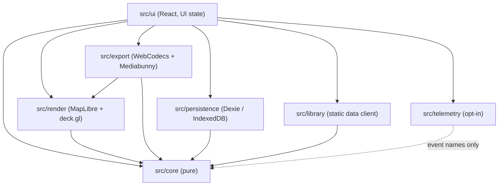
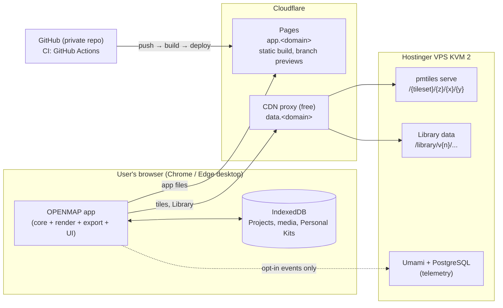
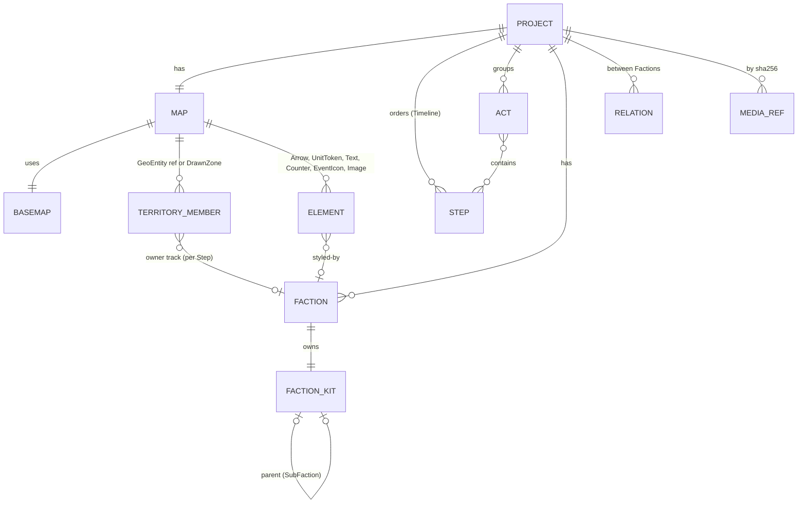

# Architecture Spine — OPENMAP v1

## Design Paradigm

**Functional core / imperative shell, local-first.** The Project is an immutable document changed only by Commands. A pure, deterministic evaluator turns `(project, t)` into a Scene. Every consumer (edit view, Presentation mode, Step thumbnails, video/image export) draws a Scene and never computes animation itself. There is no application backend in v1. The browser does all editing, rendering, encoding and storage. Servers only deliver static files (the app, tiles, Library data) and receive opt-in telemetry events.

| Layer | Directory | Is | May import |
| --- | --- | --- | --- |
| Core | `src/core/` | Domain model, Commands, evaluator, geometry derivation, historical dates, seeded PRNG, schema + migrations | nothing outside `src/core/` (plus pure libs: immer, zod, turf, nanoid) |
| Adapters | `src/render/`, `src/export/`, `src/persistence/`, `src/library/`, `src/telemetry/` | Imperative shell: WebGL drawing, encoding, IndexedDB, network | `src/core/`, platform libs |
| UI | `src/ui/`, `src/i18n/` | React app, UI state, tools | `src/core/`, adapters through their public `index.ts` |



## Invariants & Rules

### AD-1 — One pure evaluator produces every frame [ADOPTED]

- **Binds:** FR-39..FR-47, FR-50, FR-51, FR-57, NFR-1; `src/core/evaluate`, `src/render`, `src/export`
- **Prevents:** preview, Presentation mode, thumbnails and export each computing animation their own way and drifting apart.
- **Rule:** `evaluate(project, t): Scene` is the only place where time-dependent state is computed. `t` is timeline seconds (number). Export frame `i` is evaluated at `t = i / fps`. Scene is plain serializable data: resolved styles, geometries, positions, opacities, camera `{center, zoom, bearing, pitch}`, locked credits. Renderers are pure consumers of a Scene. Forbidden anywhere outside the evaluator: CSS transitions/animations on map content, library tweens, deck.gl `transitions`, MapLibre `flyTo`/`easeTo`/`panTo` or any MapLibre-driven animation. Presentation and export set the camera with `jumpTo(scene.camera)` per frame. In Edit mode, direct user pan/zoom of the edit camera is allowed. It is UI state and never enters the Project.

### AD-2 — Determinism: no ambient randomness or clock in the core

- **Binds:** FR-42, NFR-1; `src/core`
- **Prevents:** Organic Signature jitter, overshoot or pulse differing between two plays, or between preview and export.
- **Rule:** `src/core` never calls `Math.random`, `Date.now`, `performance.now`, `new Date()` or `crypto.getRandomValues`. All randomness comes from `rng(seed)` (seeded PRNG in `src/core/random`). The seed of an element is derived from its stable id (hash of `element.id` + a purpose salt, e.g. `"border-jitter"`). A lint rule enforces the ban. Evaluating the same Project at the same `t` returns a deep-equal Scene (unit-tested).

### AD-3 — The Project changes only through Commands

- **Binds:** FR-12..FR-58 (all edits), FR-55 undo/redo, FR-53 autosave; `src/core/commands`, `src/ui`
- **Prevents:** UI code mutating the document directly, which breaks undo, autosave detection and multi-tab safety.
- **Rule:** The Project document is immutable (Immer-produced). A Command is `{type, payload}`. `apply(project, command) → {project, inverse}` is pure and lives in `src/core/commands`. One user gesture = one Command (compound Commands allowed, e.g. "apply to all Steps") = one undo entry. The undo/redo stack holds inverses in memory only; it is never persisted (per EXPERIENCE). Each applied Command increments `project.revision`. UI-only state (selection, active tool, playhead, edit camera, open panels) lives in Zustand stores in `src/ui` and never in the Project document.

### AD-4 — Step state is stored sparsely and resolved by forward inheritance

- **Binds:** PRD §4.0, FR-19, FR-20, FR-24, FR-30, FR-36, FR-39, FR-40, FR-45
- **Prevents:** one feature storing full per-Step snapshots while another stores deltas; Step reorder/delete corrupting values.
- **Rule:** Steps have stable ids and live in `project.steps` (ordered array of ids = Timeline order). Every Step-varying property of an element is a track `Record<StepId, Value>` holding only explicitly set values. The value at Step N is the value set at the latest Step at or before N in Timeline order; if none is set, it is the element default. Setting at N writes only `track[N]`. "Apply to all Steps" writes the first existing Step and deletes later keys. Deleting a Step deletes its keys (later Steps then inherit from the previous one, FR-40). Element existence is `{fromStep, untilStep?}` by Step id (FR-45). Territory ownership is a track on each GeoEntity/DrawnZone reference (`owner: FactionId | null`), and a GeoEntity has exactly one owner per Step (§4.0). `stepDate` is display data only; it never reorders Steps by itself.

### AD-5 — Derived geometry is computed, never stored

- **Binds:** FR-18..FR-25, FR-31, FR-35, FR-36, FR-9 (auto labels), FR-46 (auto framing)
- **Prevents:** a stored front line, Territory union, Legend or label anchor going stale after an edit made by another feature.
- **Rule:** Territory outlines, Front Lines (from Relations, FR-22/23), Pocket shapes, Token Series layout, Legend entries, label and Counter anchors, and auto-framing boxes are derived by pure functions in `src/core/derive`. They are memoized by `(project.revision, stepId)` and are never written into the Project or Project File. User corrections are stored as inputs (e.g. a DrawnZone, a GeoEntity override, a renamed Legend entry), never as edited derived output.

### AD-6 — Renderer split: MapLibre draws the Basemap, deck.gl draws the Project

- **Binds:** FR-5, FR-17..FR-38, FR-46, FR-47, NFR-2; `src/render`
- **Prevents:** half the elements rendered as MapLibre sources and half as deck.gl layers, with inconsistent z-order, styling and export capture.
- **Rule:** MapLibre GL JS renders only Basemap layers (stylized or satellite) and the camera. Every Project element (Territories incl. GeoEntity fills, DrawnZones, Front Lines, Arrows, Tokens, Texts, Counters, date display, Legend, credits, imported images) is a deck.gl layer in `MapboxOverlay` interleaved mode, built from the Scene only. Editing affordances (handles, cursors, selection outlines, brush preview) are drawn in a separate UI overlay layer that is excluded from export capture, and never use the UI accent colour (DESIGN rule). The Map looks identical in light and dark UI themes.

### AD-7 — Export runs the same pipeline, frame by frame, in the browser

- **Binds:** FR-50, FR-51, NFR-1, NFR-3, NFR-4
- **Prevents:** an export path that re-implements animation or captures frames before tiles are loaded.
- **Rule:** Export creates its own map + overlay instance at the output size (1080p for the Output Format), steps frames `i = 0..n`, evaluates `t = i/fps`, applies the Scene, waits until the map reports all tiles loaded for that frame (pausing per EXPERIENCE after 20 s without progress), captures the canvas into a `VideoFrame`, and encodes with WebCodecs `VideoEncoder` (H.264) muxed to MP4 by Mediabunny. Image export (FR-51) captures one such frame. No server-side rendering. Unsupported browsers are detected by feature test (`VideoEncoder`, WebGL2) before export starts, not by user-agent sniffing.

### AD-8 — Local persistence: IndexedDB is the single source of truth on the device

- **Binds:** FR-52, FR-53, FR-54, NFR-5, NFR-6; `src/persistence`
- **Prevents:** Projects split across localStorage, OPFS and IndexedDB by different features; media duplicated inside every save.
- **Rule:** All persisted user data (Projects, Personal Kits, imported media, settings, telemetry consent) lives in one Dexie database, accessed only through `src/persistence`. A Project is saved as a whole-document snapshot, debounced ≤ 1 s after the last Command and never later than 5 s after a change (NFR-5). Imported media are stored once as blobs keyed by SHA-256 content hash; the Project references media by hash only. `navigator.storage.persist()` is requested on first Project creation. Quota and persistence status drive the storage banner. Nothing else writes Project data (no localStorage for Project content).

### AD-9 — Versioned document schema with forward-only migrations

- **Binds:** FR-54, FR-16, FR-53; `src/core/schema`
- **Prevents:** an app update making older saved Projects or Project Files unreadable, or two features evolving the shape incompatibly.
- **Rule:** Project, Kit file and Project File manifest each carry an integer `schemaVersion`. The shape is defined once as a Zod schema in `src/core/schema`. Every load path (IndexedDB read, Project File import, Kit import, Library Template load) runs `migrate(fromVersion → current)` then validates. Migrations are pure, chained `vN → vN+1`, never deleted, and each has a fixture test. A shape change without a version bump + migration fails CI.

### AD-10 — Project File format

- **Binds:** FR-54, FR-16
- **Prevents:** incompatible export/import implementations and non-reproducible reimports.
- **Rule:** A Project File is a ZIP (built with fflate) with extension `.openmap` containing `manifest.json` (`format: "openmap-project"`, `schemaVersion`, app version, pinned Library data versions), `project.json` (the document, Kits embedded as copies) and `media/<sha256>.<ext>`. Reimport yields a new local Project id and an identical document otherwise (same element ids, so the same seeds and the same animation, FR-54). Personal Kit files use the same container with `format: "openmap-kit"`.

### AD-11 — Kits are copies; Sub-faction inheritance is resolved at evaluation

- **Binds:** FR-12..FR-17, FR-42
- **Prevents:** live links from a Project to the Library or to Personal Kits (the Library would then silently change Projects), and Sub-faction inheritance baked in at copy time.
- **Rule:** Every Faction owns exactly one `FactionKit` stored inside the Project. Applying a Library or Personal Kit deep-copies it and records provenance only (`source: {kind, id, version}`), which is never used for lookup at render time. A Sub-faction Kit stores `parentKitId` plus a sparse `overrides` object; effective Kit fields are resolved in `src/core` at evaluation, so a parent change propagates to non-overridden fields (FR-14). Updating a Project from a changed Personal Kit is an explicit Command.

### AD-12 — Stable identifiers and pinned Library data versions

- **Binds:** FR-6, FR-11, FR-13, FR-54, AD-2, AD-4
- **Prevents:** a Library/boundary data update shifting shapes inside existing Projects; id schemes that differ per feature.
- **Rule:** Every Project element, Step, Faction and Kit gets a `nanoid` string id at creation that never changes. GeoEntities are referenced as `{dataset, datasetVersion, entityId}` using the dataset's own stable id. A Project pins the Library data versions it was created with. Published Library data versions are immutable and stay online (versioned paths). A Project moves to newer data only through an explicit, undoable Command. Project-local corrections of a GeoEntity (FR-11) are stored as a Project-level override keyed by that reference.

### AD-13 — Historical dates are not JavaScript `Date`s

- **Binds:** FR-6, FR-37, FR-40, Template metadata, Library queries
- **Prevents:** BCE dates, year-only precision and proleptic calendars breaking in one feature but not another.
- **Rule:** All historical dates (`referenceDate`, `stepDate`, dataset validity ranges) use `HistoricalDate = {year: integer (astronomical: 1 BCE = 0, 52 BCE = -51), month?: 1..12, day?: 1..31}` from `src/core/dates`, with its own compare, interpolate (for the date display) and locale formatting ("52 av. J.-C." / "52 BC"). JS `Date` is allowed only for real-world timestamps (save times, telemetry).

### AD-14 — Coordinates are stored in WGS84 longitude/latitude

- **Binds:** FR-18..FR-38, FR-47, FR-49
- **Prevents:** some elements stored in screen pixels or Web Mercator, breaking Output Format changes (FR-50) and camera recomputation.
- **Rule:** All geographic positions and geometries in the Project are `[lon, lat]` (GeoJSON order). Screen-anchored overlays (titles, Legend, date display, credits) are stored as `{anchor: edge/corner, offset in export px @1080}` relative to the output frame, so they stay on the same edge when the Output Format changes. Projection to screen happens only in `src/render`.

### AD-15 — Single-writer lock per Project across tabs

- **Binds:** FR-53, EXPERIENCE "Projet ouvert dans un autre onglet"
- **Prevents:** two tabs autosaving the same Project and overwriting each other.
- **Rule:** Editing a Project requires holding the Web Locks API lock `openmap:project:<id>`. Only the holder applies Commands and writes to IndexedDB. Other tabs open read-only (play, scrub, present, export still allowed). "Take over here" is coordinated over a `BroadcastChannel`: the holder flushes its pending save, releases the lock and switches itself to read-only. No automatic takeover when the holder closes.

### AD-16 — Network boundary and privacy

- **Binds:** NFR-6, FR-58, FR-10
- **Prevents:** a feature quietly sending Project content, media or identifiers to a third party.
- **Rule:** At runtime the app may contact only: its own origin (app files), the OPENMAP data origin (tiles, Library data), and the telemetry endpoint when consent is on. No other runtime third-party calls: no third-party fonts/CDNs (fonts are self-hosted), no error-tracking SaaS, no map provider. Telemetry goes only through `src/telemetry`, which sends events from a closed, typed allowlist (event name + coarse enumerated properties such as template type, Output Format, fps, duration bucket). Never free text, Project names, geometry, media or ids that could re-identify content. No event is sent before explicit consent. Consent can be revoked at any time.

### AD-17 — Licences: permissive-only, attribution travels with the data

- **Binds:** PRD §5, FR-10, FR-50, Q1 (closed source)
- **Prevents:** a copyleft or non-commercial dependency or dataset slipping in; an export missing a mandatory credit.
- **Rule:** Code dependencies must be MIT, BSD, ISC, Apache-2.0 or OFL (fonts). MPL-2.0 is allowed only for unmodified dependencies (Mediabunny). GPL/LGPL/AGPL and dual licences that include GPL are refused. CI runs a licence check on the dependency tree. Library data allowed: public domain, CC0, CC BY, Copernicus terms. OSM-derived basemap tiles (ODbL) are allowed only as a rendered Basemap (produced work) with attribution. Non-commercial and share-alike datasets are refused. Every Basemap and dataset carries `{source, licence, attribution, creditRequired}` metadata. When `creditRequired`, the evaluator always emits the credit into the Scene; the user may change only its corner and prominence (DESIGN "crédit verrouillé").

### AD-18 — Fixed origins; hosting and data serving topology

- **Binds:** FR-5, FR-53 (storage is per-origin), NFR-6, cost ceiling (PRD §8)
- **Prevents:** a domain change orphaning every user's local Projects; tiles served in a way the CDN cannot cache; a paid provider added unnoticed.
- **Rule:** The app origin (e.g. `app.<openmap-domain>`) is fixed before public launch and never changes. The host behind it may change. The app is a static build on Cloudflare Pages. Tiles and Library data are served from a separate data origin (e.g. `data.<openmap-domain>`): the Hostinger VPS behind the Cloudflare proxy (free plan), with CORS allowing the app origin. PMTiles archives are served as `/{tileset}/{z}/{x}/{y}` by `pmtiles serve` (never raw `.pmtiles` Range reads through the CDN). Library data paths are versioned and immutable (`Cache-Control: public, max-age=31536000, immutable`). Development builds may use third-party tile services (e.g. maptoolkit.org) for prototyping. Production builds may not; the build fails if a non-OPENMAP tile URL is configured. Any recurring paid service requires an explicit decision recorded in this spine.

### AD-19 — Browser support and capability gating

- **Binds:** NFR-4, NFR-8, FR-50
- **Prevents:** features silently failing on unsupported browsers.
- **Rule:** Targets are the current Chrome and Edge on desktop. Firefox is best effort. At startup the app feature-tests WebGL2, IndexedDB and `navigator.storage`; the export dialog tests `VideoEncoder` support for H.264 at 1080p. Mobile/tablet (coarse pointer + narrow viewport) shows the "designed for desktop" message. Minimum layout width: 1366×768.

### AD-20 — Interface strings are keys; Map labels are data

- **Binds:** EXPERIENCE (FR/EN UI), FR-9, FR-34, PRD Q4
- **Prevents:** hard-coded UI text, or Map labels routed through UI translation (they would change when the user switches UI language).
- **Rule:** Every UI string goes through i18next keys (`fr`, `en` resources in `src/i18n`). Map labels (place names, Faction names, texts, Legend entries) are Project/Library data, rendered in the source dataset's language and user-renamable per Project. They never change with UI language in v1.

## Consistency Conventions

| Concern | Convention |
| --- | --- |
| Domain vocabulary (code is English; PRD/UX glossary is French) | Projet=`Project`, Carte=`Map`, Étape=`Step`, Acte=`Act`, Timeline=`Timeline`, Fond de carte=`Basemap`, Entité géographique=`GeoEntity`, Zone dessinée=`DrawnZone`, Territoire=`Territory`, Poche=`Pocket`, Relation=`Relation`, Ligne de front=`FrontLine`, Trace de front=`FrontTrace`, Faction=`Faction`, Sous-faction=`SubFaction`, Kit de Faction=`FactionKit`, Kits personnels=`PersonalKit`, Emblème=`Emblem`, Bibliothèque=`Library`, Template=`Template`, Flèche=`Arrow`, Catégorie de flèche=`ArrowCategory`, Jeton d'unité=`UnitToken`, Série de Jetons=`TokenSeries`, Icône d'événement=`EventIcon`, Zone d'annotation=`AnnotationZone`, Compteur=`Counter`, Horodatage=`DateDisplay`, Légende=`Legend`, Calque=`Layer`, Preset caméra=`CameraPreset`, Signature organique=`OrganicSignature`, Effet d'ambiance=`AmbientEffect`, Format de sortie=`OutputFormat`, Date de référence=`referenceDate`, Date d'Étape=`stepDate`, Région=`Region`, Ère=`Era`, Fichier projet=`ProjectFile`. |
| Naming | Types `PascalCase`; functions/vars `camelCase`; files `kebab-case.ts`; React components `PascalCase.tsx`; Commands `verbNoun` in `SCREAMING_SNAKE` type strings (`SET_TERRITORY_OWNER`); telemetry events `snake_case` (`export_completed`). |
| Ids | `nanoid` strings, never array indexes. References are typed ids (`FactionId`, `StepId` branded strings). |
| Time | Timeline time in seconds (`number`); durations in the document in milliseconds (integers); historical dates per AD-13. |
| Colours & units | Colours as `#RRGGBB` / `#RRGGBBAA` strings in the document; Map sizes (labels, strokes) in export px @1080p, scaled at render. |
| Errors | Core functions return `Result<T, DomainError>` for expected failures (invalid import, missing data) and throw only on programmer errors. `DomainError = {code: string, params}`; the UI maps `code` to an i18n key. No raw error text shown to users. |
| Async & loading | Tiles and Library data load asynchronously and never block editing (EXPERIENCE). Only export and Presentation start wait for tiles. |
| Logging | `console` only in development. No remote logging in v1 (AD-16). |
| Config | Build-time env vars prefixed `VITE_` (data origin URL, telemetry URL). No secrets exist in the client. |
| Tests | Core: Vitest unit tests with fixtures (evaluator determinism, commands + inverses, migrations). E2E: Playwright on Chromium, including a golden test that compares a Presentation-mode frame with the exported frame at the same `t`. |
| Styling | shadcn/ui components themed through the DESIGN.md tokens (CSS variables); no default shadcn look; no hard-coded colours in components. |

## Stack

| Name | Version |
| --- | --- |
| TypeScript | 7.0 |
| Node.js (tooling) | 24 LTS |
| Vite | 8.3 |
| React | 19.3 |
| shadcn/ui (CLI) | 4.21 |
| Tailwind CSS | 4.3 |
| MapLibre GL JS | 6.11 |
| deck.gl (`@deck.gl/core`, `@deck.gl/mapbox`) | 9.4 |
| Mediabunny (MP4 muxing; WebCodecs encoding) | 1.61 |
| Dexie (IndexedDB) | 4.4 |
| Zustand (UI state) | 5.0 |
| Immer | 11.1 |
| Zod | 4.6 |
| Turf (`@turf/turf`) | 7.4 |
| fflate (ZIP) | 0.8 |
| nanoid | 6.0 |
| i18next / react-i18next | 26.4 / 17.0 |
| lucide-react (icons) | 1.48 |
| Vitest | 5.0 |
| Playwright | 1.63 |
| pmtiles (JS, dev/pipeline use) | 4.5 |
| go-pmtiles (`pmtiles serve`, VPS) | 1.31 |
| Umami (self-hosted, PostgreSQL) | 3.3 |
| Fonts | Libre Baskerville, Source Sans 3 (OFL, self-hosted) |
| Hosting | Cloudflare Pages (app), Hostinger VPS KVM 2 + Cloudflare proxy free plan (data) |

## Structural Seed





```text
openmap/
  src/
    core/          # pure domain: model, commands, evaluate, derive, dates, random, schema, migrations
    render/        # MapLibre basemap + deck.gl overlay; Scene → pixels; edit-affordance overlay
    export/        # frame stepping, tile wait, WebCodecs + Mediabunny, image export
    persistence/   # Dexie DB, autosave, media store, project lock (Web Locks + BroadcastChannel)
    library/       # data-origin client: Templates, Kits, Emblems, GeoEntities, basemap styles
    telemetry/     # consent + typed event allowlist → Umami
    ui/            # React app (shadcn/ui), Zustand UI stores, tools, panels, Timeline
    i18n/          # fr, en resources
  pipeline/        # offline scripts: Natural Earth / Cliopatria / EOX 2016 → PMTiles + versioned Library JSON
  ops/             # VPS config: pmtiles serve, reverse proxy, Umami docker compose, backup notes
  tests/e2e/       # Playwright
```

**Environments.** `dev`: local Vite; local PMTiles or third-party prototype tiles allowed (AD-18). `preview`: Cloudflare Pages branch deployments against the production data origin (read-only data). `prod`: `main` branch on Cloudflare Pages. CI (GitHub Actions) runs typecheck, lint (incl. AD-2 bans), licence check, unit and e2e tests before Pages deploys `main`.

**Operations.** The VPS gets OS security updates and a Hostinger snapshot before each data publish. The Umami database is backed up weekly. Library data publishes are additive (new version folder; old versions kept, AD-12). Basemap disk budget on the VPS is ≤ 70 GB, so zoom levels are capped per tileset. If the VPS is down, the app still opens and edits Projects offline; missing tiles fall back per EXPERIENCE.

## Capability → Architecture Map

| Capability / Area | Lives in | Governed by |
| --- | --- | --- |
| Wizard, Templates (FR-1..4) | `ui`, `library`, `core/commands` | AD-3, AD-9, AD-11, AD-12 |
| Basemap, reference date, search, attribution (FR-5..11) | `render`, `library`, `core/dates` | AD-6, AD-12, AD-13, AD-17, AD-18 |
| Faction Kits, Sub-factions, Library/Personal Kits (FR-12..17) | `core` (resolution), `persistence`, `library` | AD-11, AD-10, AD-8 |
| Territories, conquest, Relations, Front Lines, Pockets, patterns (FR-18..27) | `core/derive`, `core/commands`, `render` | AD-4, AD-5, AD-6, AD-14 |
| Arrows, Tokens, Token Series, Event Icons, highlight (FR-28..33) | `core`, `render` | AD-1, AD-4, AD-5, AD-6 |
| Texts, Legend, Counters, date display, scale (FR-34..38) | `core/derive`, `render`, `core/dates` | AD-5, AD-13, AD-14, AD-20 |
| Timeline, transitions, Organic Signature, Acts, ambient effects (FR-39..45) | `core/evaluate` | AD-1, AD-2, AD-4 |
| Camera presets and manual framing (FR-46..47) | `core/evaluate`, `render` | AD-1, AD-5 |
| Image import, personal map background (FR-48..49) | `persistence` (media), `render` | AD-8, AD-14 |
| Video and image export (FR-50..51) | `export` | AD-1, AD-7, AD-17, AD-19 |
| Projects list, autosave, Project File, undo, layers, modes (FR-52..57) | `persistence`, `core`, `ui` | AD-3, AD-8, AD-9, AD-10, AD-15 |
| Telemetry (FR-58) | `telemetry`, VPS Umami | AD-16 |
| Performance, fidelity, browsers, privacy (NFR-1..9) | all | AD-1, AD-2, AD-6, AD-16, AD-19 |

## Deferred

- **Geo data packaging for GeoEntities** (GeoJSON vs FlatGeobuf vs vector tiles, per-Region chunking, simplification levels). Decide in the first Territory epic. AD-12 already fixes identity and versioning.
- **Moving evaluation/derivation to a Web Worker.** Only if NFR-2 fails on the reference machine. AD-1 keeps the evaluator pure, so it can move without changing contracts.
- **EOX Sentinel-2 cloudless 2016 acquisition** (official download vs. harvesting permitted by the service terms). Open question; blocks the satellite pipeline story, not the spine.
- **Recent satellite mosaic** built from raw Sentinel-2. Post-v1.
- **Map label translation** (Q4, second half). Post-v1; AD-20 keeps it additive.
- **Reverse proxy / TLS on the VPS** (tool choice). Ops story; any choice that forwards to `pmtiles serve` and sets the AD-18 headers fits.
- **Error monitoring.** None in v1 (AD-16). Revisit only with a self-hosted, content-free option.
- **Accounts, cloud sync, community Library, 4K/SVG export, audio track, tactical scale, automatic historical mode.** Out of v1 per the PRD. The local-first document model (AD-3, AD-9) is the basis for any future sync.
- **Final domain name and trademark check** ("OpenMap" already used elsewhere). Must be fixed before public launch (AD-18).
- **Code licence re-opening** (open-sourcing after P0 validation). AD-17 keeps both paths open.
